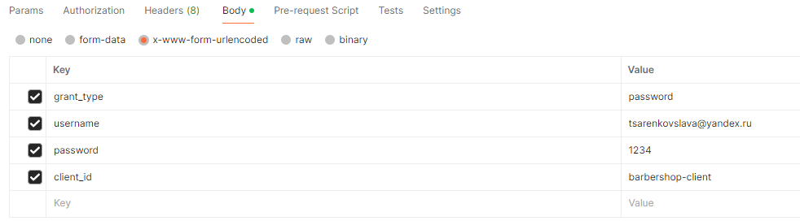

# Barber-shop-project

>For starting this project you should clone repository and run command: \
_docker compose up_ 

## Authorization service 

>You can use this service on http://localhost:8082 
> For working application you need to: 
> * import data 
for creating realm from real-export.json which is located in gateway-service in the resource folder 
> *  Create user via Admin Console
> * Get the token by using http://localhost:8082/realms/barbershop-realm/protocol/openid-connect/token with your user data
>> 
>  Use the token you've got for sending request to the Gateway http://localhost:7080

